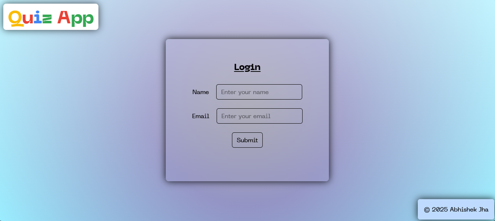

# Quiz App



A simple React-based quiz application that involves a multi-step authentication and quiz-taking process. The app allows users to authenticate, read the rules, and then take a quiz, all while displaying a background image with a gradient overlay.

## Features

- User authentication (username and email)
- Display of quiz rules
- Dynamic quiz dashboard with 30 questions
- Timer to track quiz time (30 minutes)
- Responsive UI with background image and gradient effect
- Score calculation and display after quiz submission

## Technologies Used

- React
- React Context API
- React Hooks (useState, useEffect)
- CSS (TailwindCSS for styling)

#### Trivia API | question database - [Open Trivia DB](https://opentdb.com/api.php?amount=30)

## Setup Instructions

To run the project locally, follow these steps:

### 1. Clone the repository

```bash
git clone https://github.com/your-username/react-quiz-app.git
cd react-quiz-app
```

### 2. Install dependencies

```bash
npm install
```

### 3. Run the application

```bash
npm run dev
```

## Live At 🔗

**_[https://quiz-app-jha.vercel.app/](https://quiz-app-jha.vercel.app)_**
